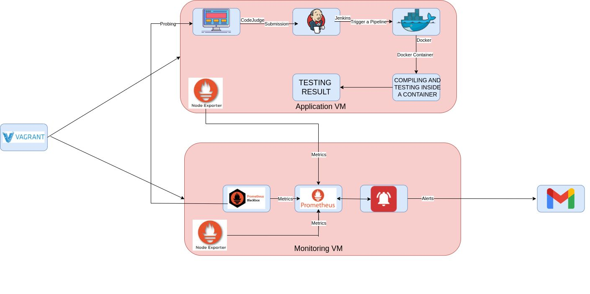

# Competitive Programming Code Judge 

## Overview
This project is a **competitive programming code judge** built with **Flask**, following **DevOps best practices** using **Jenkins** and **Docker**. It provides an automated, secure, and scalable environment for handling code submissions during programming competitions.

The project is provisioned with **Vagrant** to set up two virtual machines:
---

## 🎥 Project Demo

A full walkthrough of the system's functionality and architecture is available on LinkedIn:
[**Watch the Video Demo on LinkedIn**](https://www.linkedin.com/feed/update/urn:li:activity:7227015195930349569/)

---
1. **Application VM**
   - Hosts the **Flask application**.
   - **Jenkins** manages the CI/CD pipeline:
     - Receives submissions.
     - Runs tests.
     - Generates results.
   - **Docker** runs each submission in an isolated container to ensure:
     - Consistency
     - Reproducibility
     - Security  
   After testing, containers are removed, leaving only the results.

2. **Monitoring VM**
   - Equipped with **Prometheus** for metrics collection.
   - **Node Exporter** gathers hardware and OS metrics from both VMs.
   - **Black Box Exporter** monitors application availability and endpoint performance.
   - **Alert Manager** sends email alerts to administrators in case of issues.

---

## Architecture

---

## Benefits of Jenkins and Docker
- **Jenkins** automates testing and integration for efficient and consistent handling of submissions.  
- **Docker** provides isolated environments for each submission, eliminating conflicts and enhancing both security and reliability.  

---

## Future Objectives
- **Utilize Kubernetes Cluster**  
  - Scale the system for **college-hosted competitions**.  
  - Set up a **local Kubernetes cluster** with multiple nodes hosting the judge application.  
  - Improve scalability and fault tolerance during high-load events.

- **Create a Local Network**  
  - Establish secure and efficient communication across multiple machines.  
  - Use Kubernetes to manage workloads and balance traffic across nodes.  
  - Provide better performance and availability during competitions.  

---

